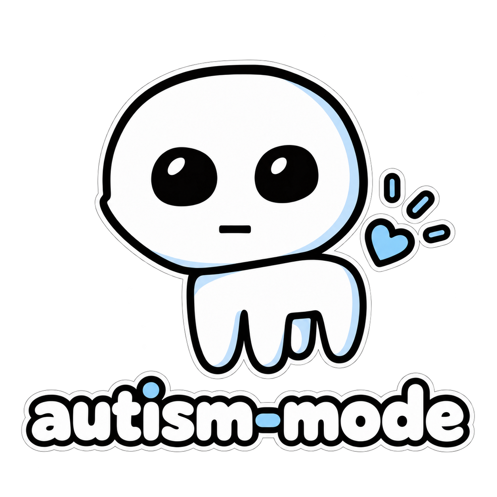

<p align="center">
  
</p>

<p align="center"><strong>Autism-friendly outputs. No mind reading required.</strong></p>

## Install

```bash
npx skills add pkhamre/autism-mode
```

## Turn it on

- **Turn on the full mode** with "autism mode", "/autism-mode", or any clear request to use it for the conversation ("use autism mode for this"). It then applies to every response until the conversation ends.
- **Ask for one behavior** ("spell out your assumptions") and you get that behavior for the current task only. The rest of the mode stays off.
- **Saying "I have autism" is disclosure, not activation.** It does not turn the mode on. No diagnosis is required either way.
- **Tune it** while it is on ("keep the assumptions, but stop labeling every paragraph"). Tuning lasts until you turn the mode off. It changes output behavior, not safety rules or system instructions.
- **Turn it off** with any clear request: "stop autism mode", "normal mode", "turn that off". The agent confirms in one line.

## What it is

A skill for your coding assistant that stops it from making you read between the lines. Assumptions are stated, scope is defined, uncertainty is labeled, and nothing is left for you to infer.

## What it does

Most agents communicate by implication. They pick a meaning for your vague request, blend facts with guesses, change the plan without saying so, and assume you share conventions you have never seen. Many readers never notice the friction. For many autistic readers it is the problem: the answer is present, but the meaning is not.

This skill changes the shape of the agent's output so the meaning is on the page:

- assumptions, prerequisites, and hidden dependencies are stated, not implied
- facts, inferences, and uncertainties are labeled separately when the difference matters
- scope is explicit, including what will not change
- "done" is defined as something observable
- plan changes are announced with a reason
- terminology stays stable, names don't drift
- language is literal by default; no idioms, sarcasm, or rhetorical questions
- choices are bounded into concrete options
- ambiguity is surfaced before acting, not silently resolved

## What changes

<table>
<tr>
<td width="50%">

## Before

> This should be pretty straightforward. We can probably reuse the existing auth middleware and clean up the token handling while we're in there. I'll update the relevant bits and then we can see if anything else needs adjusting.

</td>

<td width="50%">

## After

> **Goal:** accept expired refresh tokens only through `/auth/refresh`.
>
> **Assumption:** access tokens must still reject expired tokens.
>
> **Changes:**
> `src/auth/verify.ts`: split refresh-token verification from access-token verification.
> `src/routes/refresh.ts`: use the refresh-token verifier.
>
> **Not changing:** database schema, token format, `/auth/login`.
>
> **Done when:** existing auth tests pass, and an expired refresh-token test passes.

</td>
</tr>
</table>

## The rules

Full text in [SKILL.md](SKILL.md).

1. Make the implicit explicit.
2. Separate fact, inference, and uncertainty.
3. Say what will change, and what will not.
4. Define what "done" means.
5. No silent changes of plan.
6. One thing, one name.
7. Use literal language by default.
8. Bound choices and questions.
9. Remove social guesswork.
10. Prefer predictable structure.

One behavior ties the rest together: **surface ambiguity**. If a choice is reversible and low-impact, the agent states its assumption, names the readings it set aside, and continues. If it is irreversible or high-impact (data loss, destructive actions, security or privacy, spending, publishing, schema changes, breaking a public contract), the agent stops and offers concrete options. Unknown impact is treated as high-impact.

## Complete, not terse

This skill does not mean writing less. Missing context creates uncertainty, and removing that uncertainty is the point. Be complete without padding, and explicit without oversimplifying. Some readers want the extra detail, because missing context is the problem.

## Sibling: i-have-adhd

This skill is the sibling of [i-have-adhd](https://github.com/ayghri/i-have-adhd). They solve opposite halves of the same problem: `i-have-adhd` reduces friction so you can start, and `autism-mode` reduces ambiguity so you can trust what you read.

When both are on, the contract is: lead with the action, then give the decision-relevant assumptions, boundaries, and verification. The skill about starting does not erase the one about meaning, and if the shortest version would drop an assumption you depend on, the assumption stays.

## Tune it

Fork, edit `SKILL.md`, and keep your copy. The rules are defaults, not a diagnosis. If a rule fights how you actually want to read, change it.

## Who this is for

This skill is built with autistic readers in mind, and it can help anyone who would rather not guess what the agent meant. It defaults to identity-first language ("autistic person"), following the National Autistic Society's guidance, while respecting that individual preferences differ.

Autistic people differ. All people differ. Communication preferences vary widely, and this skill is a set of configurable defaults, not a claim that every autistic person communicates or reads the same way. It draws on widely reported preferences for direct, precise, unambiguous language and predictable structure. Since preferences vary, ask the person and adjust.

## Contributing

Contributions are welcome. See [CONTRIBUTING.md](CONTRIBUTING.md) for what helps, the one constraint to respect, and how to add eval cases.

## Credits

Inspired by [i-have-adhd](https://github.com/ayghri/i-have-adhd), which showed that output shape is an accessibility surface.

It also draws on the National Autistic Society's guidance, which notes that preferences vary but that direct, precise language and predictability help many autistic people:

- [Autism and communication](https://www.autism.org.uk/advice-and-guidance/about-autism/autism-and-communication): notes a preference for direct language over unnecessary or ambiguous language, and difficulty with non-literal language such as metaphor, idiom, and sarcasm.
- [Tips for effective communication with autistic pupils](https://www.autism.org.uk/learn/knowledge-hub/professional-practice/communication-pupils): covers literal wording, rephrasing, open-ended questions, limited options, and processing time, and repeats that every autistic person is different.
- [Guidance for the media](https://www.autism.org.uk/contact-us/media-enquiries/guidance-for-the-media): the starting advice is to ask each person how they can best be supported.

## License

MIT.
